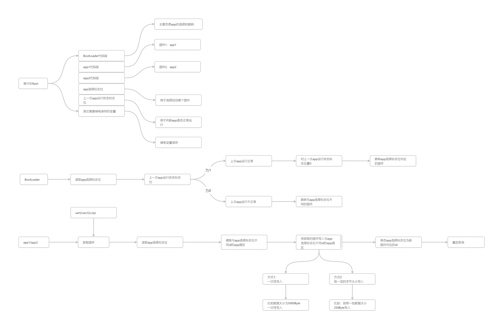

使用方法：

1.首先请查看下面的思路图了解本代码的大致思路

2.随便打开一个工程(如stm32f407igt6_boot),打开并查看BootLoader文件夹中的bootloader.h

3.stm32f407igt6_boot主要用于启动后跳转stm32f407igt6_app1或者stm32f407igt6_app2,主要看main.c中修改的部分

3.stm32f407igt6_app1表示固件1,主要看main.c中修改的部分,通过串口获取固件包数据后,直接一次性刷入到flash中,然后切换bootloader的app标志位后重启或者直接跳转新app

4.stm32f407igt6_app2表示固件2,主要看main.c中修改的部分,修改bootloader的app标志位,下一次重启时切换app
